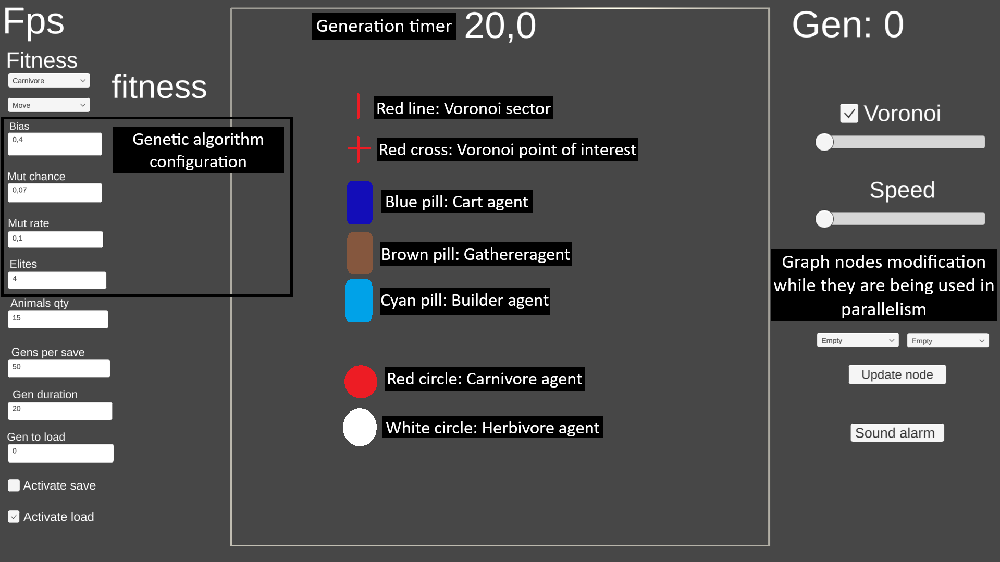
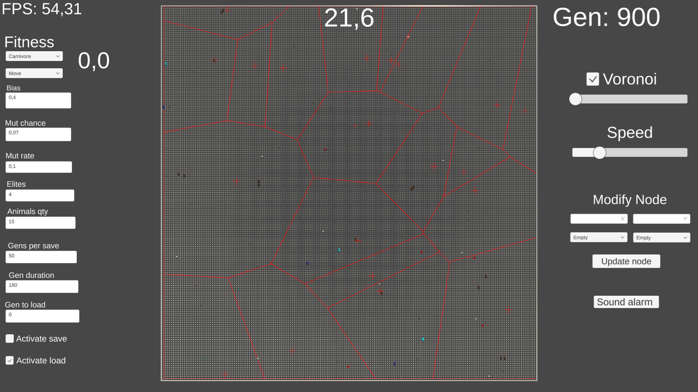

# Genetic Algorithm-Based Ecosystem Simulation

A Unity C# project developed for an Artificial Intelligence course that simulates a dynamic ecosystem. 
In this simulation, herbivore agents learn to eat, move, and escape from carnivore agents, which in turn learn to move and attack. 
Additionally, gatherers, builders, and carts operate using a finite state machine (FSM) to manage resource collection, construction, and delivery.

## Overview

This project was created to explore various advanced concepts including:
- **Genetic Algorithms:** Herbivore and carnivore agents evolve behaviors using a homebrew genetic algorithm with Uniform Crossover.
- **Finite State Machines (FSM):** Gatherers, builders, and carts follow FSM logic for decision-making.
- **Parallelism & GPU Rendering:** Enhancing performance in a real-time 2D simulation.
- **Pathfinding & Voronoi Partitioning:** Agents navigate the map and resource nodes are defined using Voronoi diagrams.
- **Data-Oriented Programming:** Implemented with ECS (Entity Component System) and C# generics/templates for better performance and scalability.

## Features

- **Evolutionary Learning:** 
  - Herbivore agents learn to seek food and evade predators.
  - Carnivore agents learn to efficiently hunt prey.
  - Genetic algorithm uses Uniform Crossover for genetic recombination.
- **Resource Management via FSM:**
  - Gatherers collect food, gold, and wood.
  - Builders use gathered resources to construct structures while consuming food.
  - Carts deliver resources to the appropriate agents.
- **Performance Optimizations:**
  - Parallel processing and GPU rendering techniques.
  - Efficient pathfinding and resource allocation using Voronoi diagrams.
- **Custom Engine Components:**
  - Homebrew implementations of ECS, FSM, and genetic algorithms – no external library dependencies.

## Installation

1. **Unity Version:**  
   Ensure you have **Unity 2022.3.X** installed.

2. **Clone the Repository:**  

   git clone https://github.com/BarraSantiago/InteligenciaArtificial

   
3. **Open the Project:**  
   Open the cloned project folder in Unity.

4. **Build & Run:**  
   Follow your standard Unity build process to run the simulation.

## Usage

- **Simulation Controls:**  
  Customize simulation parameters in the UI.
- **Development Insights:**  
  The project is structured to demonstrate how genetic algorithms, FSM, parallelism, and data-oriented design can work together in a complex ecosystem simulation.

## Screenshots

- Simulation Explanation
> 
- Simulation Running
> 

## Credits

- **Image Campus University**
- **Professor:** Leandro Rodriguez
- **Team Members:** Nicolas Ramos Marin, Tobias Godoy

## License

This project is licensed under the [MIT License](LICENSE).

---

*This project was initially developed for an AI university course and is now showcased as part of my professional portfolio to highlight advanced AI and simulation techniques in game development.*
